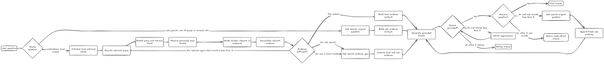
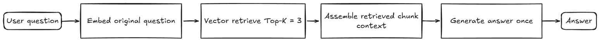

# Adaptive RAG with Azure OpenAI + Exa (plain Python, no frameworks)

An adaptive Retrieval-Augmented Generation chatbot built from scratch in plain
Python — no LangChain, LangGraph, or other orchestration frameworks. It routes
each question, rewrites retrieval queries, performs evidence-driven multi-round
local retrieval, falls back to web search when needed, and generates a grounded
answer.

## Workflow diagrams

### Agentic RAG



### Naïve RAG baseline



The naïve baseline retrieves Top-K chunks once with the original question and
generates one answer. The agentic workflow adds routing, query rewriting,
evidence grading, iterative retrieval, web fallback, and answer validation.

## Evaluation: naïve RAG versus agentic RAG

The benchmark uses the same local corpus, embedding model, answer model, and
Top-K value for both systems. The naïve baseline follows the standard
retrieve-then-read pattern: it embeds the original question, retrieves Top-3
chunks once, and generates one answer. It does not route, rewrite, grade,
retrieve again, search the web, or retry generation. The agentic system runs
the full evidence-driven workflow. Each answer is scored blindly from 0 to 2
against the expected facts in `questions/agentic_rag_eval_20.json`; the evaluator does
not receive the system identity. The reported relative improvement is
`(agentic mean - naïve mean) / naïve mean × 100`, and the target is at least
20%.

Run the live benchmark (this makes Azure OpenAI and, for corpus-insufficient
questions, Exa API calls):

```bash
python evaluation/run_benchmark.py
```

The command writes a timestamped full report to `evaluation/results/`,
including answers, retrieved chunks, retrieval traces, per-answer scores, and
latency for both systems. Review all twenty blind scores manually before using
the result in a submission.

### Benchmark result

The recorded run in
`evaluation/results/benchmark-20260927-111126.json` met the acceptance target:

| Metric | Naïve RAG | Agentic RAG |
| --- | ---: | ---: |
| Questions evaluated | 20 | 20 |
| Correctness points | 17 / 40 | **32 / 40** |
| Normalized score | 42.5% | **80.0%** |
| Relative improvement | — | **88.24%** |
| Multi-hop subset | 3 / 6 | **6 / 6** |
| Average local retrieval rounds | 1.00 | **1.45** |
| Average latency | 3.00 s | **38.29 s** |

The Agentic RAG result exceeds the required 20% improvement over one-shot
retrieve-then-read RAG. Its multi-hop score also shows the benefit of the
second, evidence-gap-driven local retrieval round. The quality gain has a clear
cost: the full agentic workflow was about 12.8 times slower on average because
it makes additional model, retrieval, validation, and fallback calls.

This is an end-to-end result, not a local-retrieval-only ablation. The agent
used web search on 11 of the 20 questions, including 9 questions that began on
the local-corpus route. Therefore, the reported improvement reflects the whole
agentic workflow—routing, query rewriting, iterative retrieval, validation,
and web fallback—not only the local query-rewrite loop. A future local-only
ablation can isolate the contribution of iterative local retrieval.

### Reflection: when agentic RAG wins

Agentic RAG is most useful when an initial retrieval provides only part of the
evidence needed to answer a question. Query rewriting helps match the language
of a user question to terminology used in the source documents. An explicit
second retrieval round is especially valuable for multi-hop questions that need
two related concepts, such as identity-based access control and
micro-segmentation. The evidence decision also helps the system avoid treating
the first Top-K result as automatically sufficient. These benefits cost more
latency, model calls, and operational complexity than a one-shot RAG system.
For simple factual questions where the first retrieved chunk is already
complete, naïve retrieve-then-read may be faster and just as effective.

## Project Structure

```
AgenticRag/
│
├── app.py                 # main CLI: load KB -> pipeline -> print answer
├── adaptive.py            # answer_question() pipeline (route/retrieve/grade/fallback/generate)
├── router.py              # route_question() + dispatch()
├── config.py              # .env loading, Azure OpenAI + Exa client builders
│
├── tool/
│   ├── knowledge_base.py  # doc scan, chunking, batched cached embeddings
│   ├── retriever.py       # Top-K cosine retrieval
│   ├── grader.py          # per-chunk relevance grading
│   ├── query_rewrite.py   # retrieval-oriented query rewrite per local round
│   ├── retrieval_decision.py # choose answer / retrieve again / web fallback
│   ├── hallucination.py   # grounded/hallucinated judge + reason
│   ├── answer_check.py    # does the answer resolve the question?
│   ├── loading.py         # stage spinner + timing (stdlib only)
│   └── web_search.py      # Exa Search branch -> [{title, url, text}]
│
├── test/
│   ├── test_routing.py        # live routing check (6 questions)
│   ├── test_retrieve_grade.py # live retrieve + grade on synthetic corpus
│   ├── test_fallback.py       # mocked branching (no API calls)
│   ├── test_hallucination.py  # mocked judge + retry + refuse (no API calls)
│   ├── test_answer_check.py   # mocked sufficiency + web rounds (no API calls)
│   ├── test_agentic_retrieval.py # mocked multi-round local retrieval loop
│   ├── test_benchmark.py      # mocked naïve-vs-agentic benchmark checks
│   └── test_chat_loading.py   # mocked chat loop + stage output (no API calls)
│
├── evaluation/
│   ├── scorer.py              # blind 0/1/2 answer scorer + aggregation
│   └── run_benchmark.py       # writes timestamped detailed reports
│
├── questions/
│   └── agentic_rag_eval_20.json # fixed 20-question, fact-rubric suite
│
├── naive_rag/
│   └── naive_rag.py           # one-shot Top-3 retrieve-then-read baseline
│
├── data/                  # indexed documents (.txt, .pdf)
├── asset/                 # workflow diagram
├── vector_store/          # embeddings_cache.pkl (gitignored, auto-created)
│
├── ingest.py / chat.py    # legacy local-Ollama FAISS flow (not Azure)
├── requirements.txt
├── .env / .env.example
└── .gitignore
```

---

## Setup

Create a virtual environment (Windows):

```bash
python -m venv venv
venv\Scripts\activate
pip install -r requirements.txt
```

Copy `.env.example` to `.env` and fill in:

```
AZURE_OPENAI_ENDPOINT=https://<your-resource>.services.ai.azure.com/openai/v1
AZURE_OPENAI_LLM_DEPLOYMENT=gpt-5.6-luna
AZURE_OPENAI_EMBEDDING_DEPLOYMENT=text-embedding-3-small
AZURE_OPENAI_USE_ENTRA=false
AZURE_OPENAI_API_KEY=<your-key>
EXA_API_KEY=<your-key>
EXA_MAX_RESULTS=5
# optional: EMBED_BATCH_SIZE=100
```

Use `AZURE_OPENAI_USE_ENTRA=true` with `az login` instead of an API key
if you prefer Entra ID auth.

---

## Usage

Run the chatbot (continuous chat — type `quit` to exit):

```bash
python app.py
```

Each question shows live stage lines with timings:

```
[...] Routing question... done (0.8s)
[...] Retrieving documents... done (0.5s)
[...] Grading documents... done (1.1s)
[...] Generating answer... done (2.3s)
[...] Checking for hallucinations... done (1.0s)
[...] Checking if answer resolves the question... done (0.9s)
```

(Animated spinner + lines in a terminal; silent when piped.)

First run embeds the whole `data/` corpus in batches of `EMBED_BATCH_SIZE`
and writes `vector_store/embeddings_cache.pkl`. Later runs reuse the cache
(zero embedding calls) and only embed new or changed chunks.

Run the tests:

```bash
python test/test_routing.py        # live: routing decisions
python test/test_retrieve_grade.py # live: retrieval ranking + grading
python test/test_fallback.py       # mocked: fallback branching, no API spend
python test/test_hallucination.py  # mocked: judge + retry + refuse, no API spend
python test/test_answer_check.py   # mocked: sufficiency + web rounds, no API spend
python test/test_chat_loading.py   # mocked: chat loop + stage output, no API spend
python test/test_agentic_retrieval.py # mocked: query rewrite + multi-hop retrieval
python test/test_benchmark.py      # mocked: baseline and score aggregation
```

---

## Technologies

- Python (plain, no RAG frameworks)
- Azure OpenAI: `gpt-5.6-luna` (routing, grading, generation),
  `text-embedding-3-small` (1536-dim embeddings)
- Exa Search API (`exa-py`) for the Web Search branch
- `pypdf` for PDF ingestion, `numpy` for cosine similarity
- `python-dotenv` + `azure-identity` for config and auth
