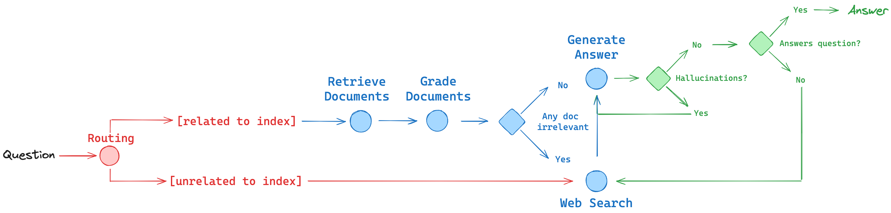

# Adaptive RAG with Azure OpenAI + Exa (plain Python, no frameworks)

An adaptive Retrieval-Augmented Generation chatbot built from scratch in plain
Python — no LangChain, LangGraph, or other orchestration frameworks. It routes
each question, retrieves and grades local documents, falls back to web search
when needed, and generates a grounded answer.

Pipeline (see `asset/workflow.png`):



```
Question
   │ Routing (router.py)
   ├─ [related to index] ──► Retrieve (tool/retriever.py)
   │                            │ Grade each chunk (tool/grader.py)
   │                            ├─ all relevant ──► Generate Answer (chunks)
   │                            └─ any irrelevant ► Web Search ─► Generate (chunks + web)
   └─ [unrelated to index] ──► Web Search (tool/web_search.py) ─► Generate (web)

Generated answer is then hallucination-checked (tool/hallucination.py):
grounded → return; hallucinated → regenerate (max 3 strict retries),
still failing → refuse.

Finally the answer itself is judged (tool/answer_check.py): does it actually
resolve the question? `no` → extra Web Search round + regenerate (max 2
rounds), then the best effort stands.
```

---

## Features

- Multi-file ingestion: scans `data/` for `.txt` and `.pdf` (thesis corpus)
- Batched Azure embeddings (`text-embedding-3-small`) with SHA-256 disk cache
- Top-K cosine retrieval with per-chunk source labels
- LLM-as-judge relevance grading (`relevant` / `irrelevant` per chunk)
- Exa web-search fallback combining relevant chunks + web results
- Hallucination judge (every claim supported + gist consistent), 3 strict retries, refuse on failure
- Answers-question judge (sufficiency), up to 2 extra web rounds, best effort kept
- Query routing (`vectorstore` / `web_search`) via `gpt-5.6-luna`

---

## Project Structure

```
AgenticRag/
│
├── app.py                 # main CLI: load KB -> pipeline -> print answer
├── adaptive.py            # answer_question() pipeline (route/retrieve/grade/fallback/generate)
├── router.py              # route_question() + dispatch()
├── config.py              # .env loading, Azure OpenAI + Exa client builders
│
├── tool/
│   ├── knowledge_base.py  # doc scan, chunking, batched cached embeddings
│   ├── retriever.py       # Top-K cosine retrieval
│   ├── grader.py          # per-chunk relevance grading
│   ├── hallucination.py   # grounded/hallucinated judge + reason
│   ├── answer_check.py    # does the answer resolve the question?
│   ├── loading.py         # stage spinner + timing (stdlib only)
│   └── web_search.py      # Exa Search branch -> [{title, url, text}]
│
├── test/
│   ├── test_routing.py        # live routing check (6 questions)
│   ├── test_retrieve_grade.py # live retrieve + grade on synthetic corpus
│   ├── test_fallback.py       # mocked branching (no API calls)
│   ├── test_hallucination.py  # mocked judge + retry + refuse (no API calls)
│   ├── test_answer_check.py   # mocked sufficiency + web rounds (no API calls)
│   └── test_chat_loading.py   # mocked chat loop + stage output (no API calls)
│
├── data/                  # indexed documents (.txt, .pdf)
├── asset/                 # workflow diagram
├── vector_store/          # embeddings_cache.pkl (gitignored, auto-created)
│
├── ingest.py / chat.py    # legacy local-Ollama FAISS flow (not Azure)
├── requirements.txt
├── .env / .env.example
└── .gitignore
```

---

## Setup

Create a virtual environment (Windows):

```bash
python -m venv venv
venv\Scripts\activate
pip install -r requirements.txt
```

Copy `.env.example` to `.env` and fill in:

```
AZURE_OPENAI_ENDPOINT=https://<your-resource>.services.ai.azure.com/openai/v1
AZURE_OPENAI_LLM_DEPLOYMENT=gpt-5.6-luna
AZURE_OPENAI_EMBEDDING_DEPLOYMENT=text-embedding-3-small
AZURE_OPENAI_USE_ENTRA=false
AZURE_OPENAI_API_KEY=<your-key>
EXA_API_KEY=<your-key>
EXA_MAX_RESULTS=5
# optional: EMBED_BATCH_SIZE=100
```

Use `AZURE_OPENAI_USE_ENTRA=true` with `az login` instead of an API key
if you prefer Entra ID auth.

---

## Usage

Run the chatbot (continuous chat — type `quit` to exit):

```bash
python app.py
```

Each question shows live stage lines with timings:

```
[...] Routing question... done (0.8s)
[...] Retrieving documents... done (0.5s)
[...] Grading documents... done (1.1s)
[...] Generating answer... done (2.3s)
[...] Checking for hallucinations... done (1.0s)
[...] Checking if answer resolves the question... done (0.9s)
```

(Animated spinner + lines in a terminal; silent when piped.)

First run embeds the whole `data/` corpus in batches of `EMBED_BATCH_SIZE`
and writes `vector_store/embeddings_cache.pkl`. Later runs reuse the cache
(zero embedding calls) and only embed new or changed chunks.

Run the tests:

```bash
python test/test_routing.py        # live: routing decisions
python test/test_retrieve_grade.py # live: retrieval ranking + grading
python test/test_fallback.py       # mocked: fallback branching, no API spend
python test/test_hallucination.py  # mocked: judge + retry + refuse, no API spend
python test/test_answer_check.py   # mocked: sufficiency + web rounds, no API spend
python test/test_chat_loading.py   # mocked: chat loop + stage output, no API spend
```

---

## Technologies

- Python (plain, no RAG frameworks)
- Azure OpenAI: `gpt-5.6-luna` (routing, grading, generation),
  `text-embedding-3-small` (1536-dim embeddings)
- Exa Search API (`exa-py`) for the Web Search branch
- `pypdf` for PDF ingestion, `numpy` for cosine similarity
- `python-dotenv` + `azure-identity` for config and auth
